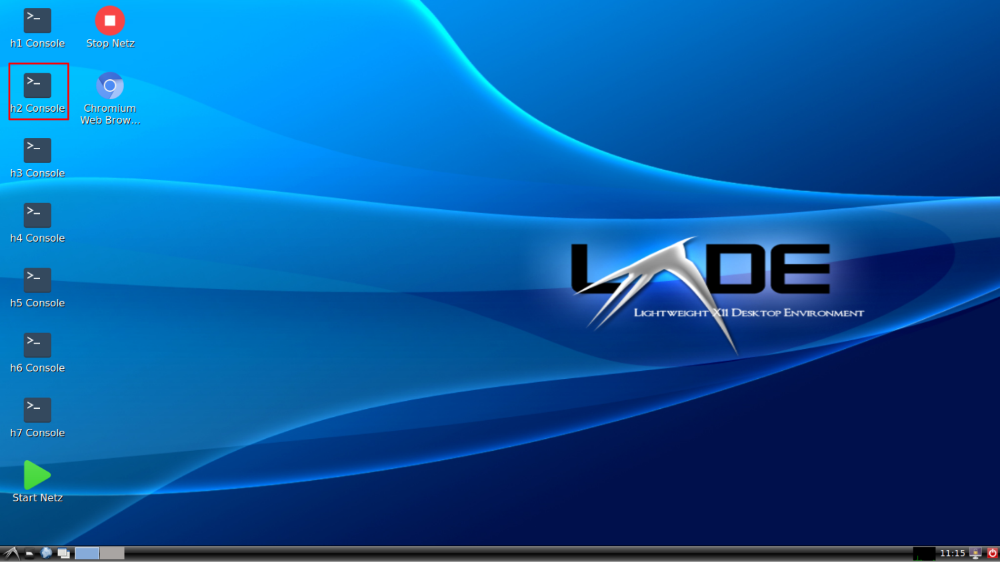

.. kurguide documentation master file, created by
   sphinx-quickstart on Thu Apr  6 21:36:22 2017.
   You can adapt this file completely to your liking, but it should at least
   contain the root `toctree` directive.

Mininet Übung
=============

**mininet** ist ein Tool um virtuelle Netzwerke zu erstellen und zu simulieren. Es wird ein
Netzwerk wie in dem untenstehenden Bild erstellt.

.. figure:: _static/mininet_network.png
   :scale: 100 %
   :alt: Network

Die Adressen der Router sind in dem Bild nicht dargestellt.
Der Router besitzt 3 Interfaces, für jedes VLAN existiert eins.
In der nachstehenden Tabelle sind die Router-Adressen für das jeweilige VLAN dargestellt.

+-------+-----------+
| VLAN | IP Address |
+======+============+
|   10 | 10.0.0.21  |
+------+------------+
|   20 | 10.0.0.22  |
+------+------------+
|   30 | 10.0.0.23  |
+------+------------+

Dieses Tutorial wird euch durch die Installation, Starten der VM und die Problembehebung führen.
Zum Starten wird eine vollständige VM imporiert, die vorkonfiguriert mit **VirtualBox** exportiert wurde.
Wenn Ihr schon vertraut seit mit **VirtualBox** könnt Ihr HIERLINKPLS die VM laden. Ansonsten folgt dem Tutorial.

.. note::
  Die Größe der **VirtualBox**'s VM ist ca. 1GB.

Installationsanleitung
----------------------

Um die **.OVA** Datei in VirtualBox zu importieren, benötigen wir selbst erstmal **VirtualBox**.
In den nachfolgenden Sektionen wird die VirtualBox-Installation und Importierung der **.OVA** Datei erläutert.

Virtualbox-Installation
*************************

Um **VirtualBox** zu installieren sind folgende Schritte notwendig:

  * Klick hier
    <https://www.virtualbox.org/wiki/Downloads>
  * Downloaded die Version, die für euer Betriebssystem bestimmt ist.
  * Nach dem Download starten und der Installationsanleitung vom Wizard folgen.

Mininet VM-Importierung
***********************

Als erstes ladet Ihr hier die VM unter folgendem Link herunter (here)[asfas].
Danach öffnet ihr **VirtualBox** und klickt unter **Datei > Appliance Importieren** oder drückt den
Shortcut **Ctrl** + **i**.

Klickt auf **Durchsuchen**.

.. figure:: _static/import_appliance.png
   :scale: 100 %
   :align: center
   :alt: Import

Wählt die VM aus und klickt auf **öffnen**.

Wählt **Weiter** aus.

Und als letztes **Import**.

.. note::
   Ihr könnt der VM mehr RAM oder Prozessorkerne zuweisen.

Wartet bis die VM vollständig importiert wurde.

VM-Start
--------

Nach der Importierung, wählt die VM aus und startet sie.

.. figure:: _static/start_vm.png
   :scale: 100 %
   :align: center
   :alt: Start Virtual Machine

VM-Einloggen
------------

Wenn die VM gestartet wurde, könnt Ihr euch auf dem Linux-System mit dem Benutzernamen und Passwort
**mininet** einloggen.

.. figure:: _static/login.png
   :scale: 100 %
   :align: center
   :alt: Login

.. note::
  Während der Passworteingabe werden keine Zeichen angezeigt! Einfach das Passwort eingeben und Enter drücken.

Nach dem Einloggen sollte die Grafische Oberfläche geladen werden.

Netzwerk Start/Stopp
--------------------

Um das virtuelle Netzwerk zu starten muss die Datei **Start Netz** ausgeführt werden.

.. note::

  Beim Starten des Skript erweckt es den Anschein, dass nichts passiert. In Wirklichkeit läuft das
  Netzwerk im Hintergrund schon. Egal wie oft ihr das Skript startet, das Netzwerk wird nur einmalig beim
  ersten Ausführen des Skripts gestartet.

Stoppen könnt Ihr das Netzwerk über das Skript **Stop Netz**.

.. figure:: _static/stop_script.png
   :scale: 100 %
   :align: center
   :alt: Stop Script

Befehle auf den Hosts eingeben
-------------------------------

Um ein Befehl auf einem beliebigen Host abzusetzen müsst Ihr das jeweilige Terminal auf dem Host öffnen.
Um den Zugriff zu erleichtern, befinden sich auf dem Desktop Terminalverbindungen zu den jeweiligen Hosts.
Als Beispiel wird der Zugriff auf den Host **h2** gezeigt.

Das Terminalfenster vom Host **h2** öffnet sich.

Nun könnt ihr z.B. einen Ping absetzen.

.. code::

  ping 10.0.0.11

Es sollte so aussehen:

Wireshark benutzen
------------------

Wenn ihr eine Netzwerkanalyse für einen bestimmten Host durchführen wollt, müsst ihr Wireshark auf das richtige
Interface einstellen. Um zum Beispiel eine Analyse für den Port ``h2-eth0`` durchzuführen, müsst Ihr wieder das
Terminal von **h2** wie in `Befehle auf den Hosts eingeben`_ öffnen.

In dem Terminal benutzt ihr dann den Befehl

.. code::

  wireshark

.. note::
  Eine Warnung könnte angezeigt werden. Auf OK klicken und ignorieren.

Wähle das  ``h2-eth0`` Interface und klicke auf Start.

.. figure:: _static/wireshark.png
   :scale: 100 %
   :align: center
   :alt: Wireshark

Das ist alles! Du führst nun eine Netzwerkanalyse für das ``h2-eth0`` Interface aus.

.. note::
  Für jeden Host könnt Ihr so viele Terminalfenster öffnen, wie Ihr möchtet.

Ping auf Broadcastadresse
-------------------------

Wenn Ihr einen Ping auf die Broadcastadresse durchführt, wird im Terminal immer die IP vom Host angezeigt.
Der Grund hierfür liegt an der VLAN-Simulation von Mininet(Zum jetzigen Zeitpunkt noch keinen Fix gefunden).

Um alle Hosts die Antworten zu finden, müsst Ihr Wireshark benutzen. Startet Wireshark wie in `Wireshark benutzen`_.
Nun könnt Ihr den Befehl abschicken und es sollten alle im gleichen Netz antworten.

.. code::

	ping -b Broadcastadresse

Tracing
-------

Mit dem Befehl **traceroute** auf Linux könnt Ihr eine Route von einem Host zu einem Ziel vefolgen.
Dabei wird analysiert, über welche Router und Knoten im Internet euer Datenpaket versendet wird.
Mehr dazu unter https://de.wikipedia.org/wiki/Traceroute.

Ein Beispiel auf Windows wie eine traceroute aussehen kann.

Troubleshooting
---------------

  * Wenn Ihr auf ein Terminalfenster für einen Host klickt und es öffnet sich nicht, überprüft
    ob das Netzwerk gestartet oder gestoppt wurde. Einfach starten wie in `Netzwerk Start/Stopp`_ erklärt.
