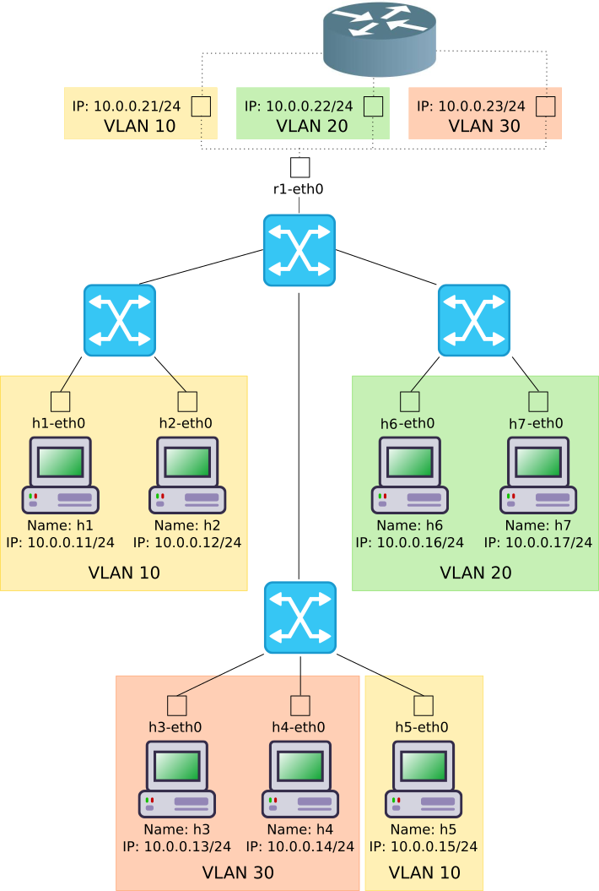

.. kurguide documentation master file, created by
   sphinx-quickstart on Thu Apr  6 21:36:22 2017.
   You can adapt this file completely to your liking, but it should at least
   contain the root `toctree` directive.

Mininet Practice
================

**mininet** is a tool for virtualizing networks. We are going to virtualize an
entire network as shown in the following figure.

Please note that the address of the router is not shown in the picture. It
varies from VLAN to VLAN as follows;

+-------+-----------+
| VLAN | IP Address |
+======+============+
|   10 | 10.0.0.21  |
+------+------------+
|   20 | 10.0.0.22  |
+------+------------+
|   30 | 10.0.0.23  |
+------+------------+

This tutorial will guide you through the installation, running and
troubleshooting everything required for having a virtual network just like the
one in the picture.

For quick starting a **VirtualBox**'s Virtual Machine with all that you will
need was prepared and can be downloaded from here (fill this in).

.. note::
  Be aware tha the **VirtualBox** is aprox. 1GB.

Installation
------------

In order to run the provided **VirtualBox**'s VM first we need to install
**VirtualBox** itself. Then import the VM. The following section will explain
how to proceed.

Install Virtualbox
******************

To install **VirutalBox** follow these steps;

  * Click `here
    <https://www.virtualbox.org/wiki/Downloads>`_.
  * Download the installer matching your running operating system. For windows,
    click on **Windows hosts**.
  * Once it finishes double click and follow the installation wirzard steps

Import Mininet's VM
*******************

First you will need to download the VM from (here)[asfas]. Then open
**VirtualBox** and click on **File > Import Appliance** or hit **Ctrl** +
**i**. As shown in the following picture.

.. figure:: _static/import-appliance.png
   :scale: 100 %
   :align: center
   :alt: Import

Click on **browse** icon as shown in the following picture.

Select the download VM and click **open** as in the following image.

.. figure:: _static/import_file_browser.png
   :scale: 100 %
   :align: center
   :alt: Browse for the VM's file

Then click **Next** as in the following picture.

.. figure:: _static/import_next_click.png
   :scale: 100 %
   :align: center
   :alt: Click next

And finally click **Import**.

.. figure:: _static/import_import_click.png
   :scale: 100 %
   :align: center
   :alt: Clicking on import

Wait for the VM to get imported, as shown in the following picture.

.. figure:: _static/import_wait.png
   :scale: 100 %
   :align: center
   :alt: Wait for the import to finish

Start Mininet's VM
------------------

Once the VM is imported, start the VM by selecting the VM from **VirtualBox**
list and click on start as shown below.

Log into Mininet's VM
---------------------

Once the VM is started login into the linux system with the username and
password **mininet**. As shown in the picture below.

.. note::
  While you type the password no characters are actually shown on screen. After
  you finish typing the passwork just hit ``Enter``.

After you login the graphical environment should launch. It look like the
following picture.

.. figure:: _static/graphical_env.png
   :scale: 100 %
   :align: center
   :alt: Graphical Environment

Start/Stop the Virtual Network
------------------------------

In order to start the virtualized network you will need to execute the
**Start Netz** script by double click it, as shown below.

.. figure:: _static/start_script.png
   :scale: 100 %
   :align: center
   :alt: Start Script

.. note::
  By double click the script it seems that nothing happens but in the background
  the network is already running. Don't worry the network will only will be
  started just once, no matter how many times you run the script.

You can stop any time the network if you like by double clicking the
**Stop Netz** script, shown below.

Running command on Host
-----------------------

For running a command on one host you just need to open the host's console.
For easy access shortcuts have been created to access every host console. For
instance, if you want to access h2's console double click it shortcut as shown
below.

.. figure:: _static/console_script.png
   :scale: 100 %
   :align: center
   :alt: Console Script

A window as the one shown below will open.

.. figure:: _static/console.png
   :scale: 100 %
   :align: center
   :alt: Console

Now, for instance, you can ping another host by running;

.. code::

  ping 10.0.0.11

It should look like;

.. figure:: _static/ping.png
   :scale: 100 %
   :align: center
   :alt: Ping

Running Wireshark
-----------------

If you want to sniff a network interface of a host you'll have to run Wireshark
on that host. For example, for sniffing ``h2-eth0`` you should open **h2**
console as `Running command on Host`_.

.. code::

  wireshark

.. note::
  A warning might pop-up. Just click **Ok** and continue.

Select the ``h2-eth0`` interface and click on start as shown below.

That's it! You are sniffing the ``h2-eth0`` interface.

.. note::
  You can open as many consoles you like for every host.

Ping the Broadcast Address
--------------------------

When you ping to the Broadcast Address, normally, the command's output shows
all the responding host's IP Addresses. Because of the simulation of the network
``ping``'s output shows only the own IP Address. (We haven't found a fix yet)

.. figure:: _static/h1_broadcast_terminal.png
   :scale: 100%
   :align: center
   :alt: h1_Broadcast

To find the Hosts' response you can use Wireshark. Start Wireshark like in
`Running Wireshark`_. By running;

.. code::

	ping -b <broadcast-address>

Now you can see the IP addresses of the responding host with Wireshark as shown
in the following picture.

.. figure:: _static/wireshark_broadcast.png
   :scale: 100%
   :align: center
   :alt: Wireshark_Broadcast

Tracing
-------

``traceroute`` allows you to see the hops and their IP addresses on the way to
the provided host. More about ``traceroute`` can be found in
https://de.wikipedia.org/wiki/Traceroute and
https://linux.die.net/man/8/traceroute. The following picture shows an example
of a typical ``traceroute`` run.

Troubleshooting
---------------

  * If you double click on a console script and it doesn't open maybe the
    network hasn't been started yet or you stopped it. Just start it as
    explained in `Start/Stop the Virtual Network`_.
